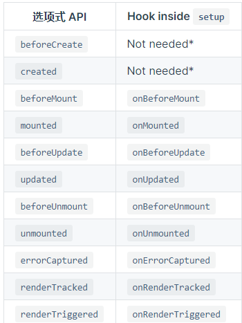

1. 什么是生命周期（`Vue`）？

   每一个`Vue`实例都有一个完整的生命周期，从开始创建、初始化数据、编译模板、挂载DOM、渲染→更新→渲染、销毁等一系列过程，我们称这是Vue的生命周期。

> 通俗说就是Vue实例从创建到销毁的过程，就是生命周期。

   `Vue3`对于生命周期钩子做了修改

>  - `beforeCreate` -> 使用`setup()`
>  - `created` -> 使用 `setup()`
>  - `beforeMount` -> `onBeforeMount`
>  - `mounted` -> `onMounted`
>  - `beforeUpdate` -> `onBeforeUpdate`
>  - `updated` -> `onUpdated`
>  - `beforeDestroy` -> `onBeforeUnmount`
>  - `destroyed` -> `onUnmounted`
>  - `errorCaptured` -> `onErrorCaptured`

2. 钩子与data数据、DOM节点

> `created`的时候`data`已被初始化
>
> `beforeMount`的时候`DOM`节点已渲染，此时还是虚拟的`DOM`
>
> `mounted`的时候数据会挂到`DOM`上去，将`{{message}}`中的`message`替换上去
>
> `beforeUpdate`可以检测到数据变化，但是`view`没有重新渲染，并且是可以改变`data`的最后机会
>
> `updated`是`view`重新渲染后出发的

3. 生命周期详细

> 每一个组件或者实例都会经历一个完整的生命周期，总共分为三个阶段：初始化、运行中、销毁。
>
> - 实例、组件通过`new Vue()`创建出来之后会初始化事件和生命周期，然后就会执行`beforeCreate`钩子函数，这个时候，数据还没有挂载呢，只是一个空壳，无法访问到数据和真实的`DOM`，一般不做操作挂载数据，绑定事件等等，
> - 然后执行`created`函数，这个时候已经可以使用到数据，也可以更改数据,在这里更改数据不会触发`updated`函数，在这里可以在渲染前倒数第二次更改数据的机会，不会触发其他的钩子函数，一般可以在这里做初始数据的获取
> - 接下来开始找实例或者组件对应的模板，编译模板为虚拟`dom`放入到`render`函数中准备渲染，然后执行`beforeMount`钩子函数，在这个函数中虚拟`dom`已经创建完成，马上就要渲染，在这里也可以更改数据，不会触发`updated`，在这里可以在渲染前最后一次更改数据的机会，不会触发其他的钩子函数，一般可以在这里做初始数据的获取
> - 接下来开始`render`，渲染出真实`dom`，然后执行`mounted`钩子函数，此时，组件已经出现在页面中，数据、真实`dom`都已经处理好了，事件都已经挂载好了，可以在这里操作真实`dom`等
> - 当组件或实例的数据更改之后，会立即执行`beforeUpdate`，然后`vue`的虚拟`dom`机制会重新构建虚拟`dom`与上一次的虚拟`dom`树利用`diff`算法进行对比之后重新渲染，一般不做什么事儿
> - 当更新完成后，执行`updated`，数据已经更改完成，`dom`也重新render完成，可以操作更新后的虚拟`dom`
> - 当经过某种途径调用`$destroy`方法后，立即执行`beforeDestroy`，一般在这里做一些善后工作，例如清除计时器、清除非指令绑定的事件等等
> - 组件的数据绑定、监听...去掉后只剩下`dom`空壳，这个时候，执行`destroyed`，在这里做善后工作也可以

4. 获取错误的钩子函数
> errorCaptured
> 当捕获一个来自子孙组件的错误时被调用。此钩子会收到三个参数：错误对象、发生错误的组件实例以及一个包含错误来源信息的字符串。此钩子可以返回 false 以阻止该错误继续向上传播

