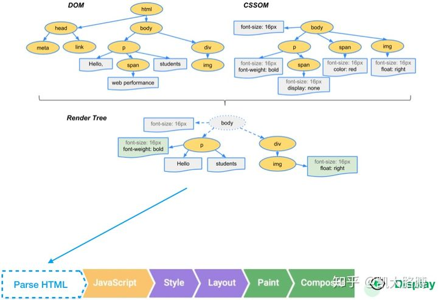

1. 浏览器渲染过程
   
   当渲染首屏时，浏览器分别解析 HTML 与 CSS 文件，
   ①生成文档对象模型（DOM）与 样式表对象模型（CSSOM）；
   ②合并 DOM 与 CSSOM 成为渲染树（Render Tree）；
   ③计算样式（ Style）；
   ④计算每个节点在屏幕中的精确位置与大小（Layout）；
   ⑤将渲染树按照上一步计算出的位置绘制到图层上（Paint）；
   ⑥渲染引擎合成所有图层最终使人眼可见（Composite Layers）。