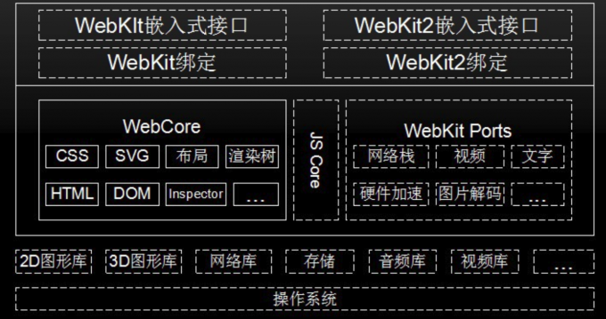

1. 各个浏览器的渲染引擎分类？

   `Tridend`(IE)、`Gecko(FF)`,`WebKit`(Safari, Chrome, 安卓)

2. 关于Webkit引擎

   这是苹果05一个开源项目，结构如下：

​	其中的js sore即是js引擎，在谷歌系列产品中替换为**V8引擎**（C++开发）

​	webcore里面包含很多解释器，CSS解释器、HTML解释器等

​	V8引擎以性能为目标一直改进，javascript sore比较稳健，渐进式的改进

​	V8引擎中少了字节码这一环节，少了中间代码的生成，更快，但也少了代码优化这一步；

​	而js core会有字节码生成（二者都有JIT编译器）