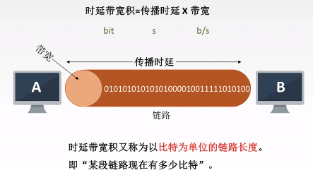
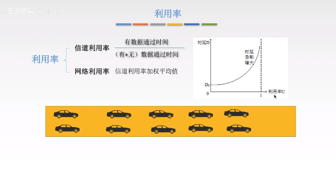

## 网络概述

1. 时延（定义：数据（报文/分组/比特流）从网络的一段传送到另一端的时间，单位：s ）

   - 发送时延（即传输时延）——从发送分组的第一个比特算起，到该分组最后一个比特发送完毕所需要的时间

     计算公式：发送时延=数据长度/信道带宽（发送速率）

   - 传播时延

     计算公式：传播时延=信道长度/电磁波在信道上的传播

   - 排队时延（等待输入/出、链路可用）
   - 处理时延（检错、找出口）

2. 时延带宽积（=传播时延*带宽）

3. 往返时延RTT

   从发送方发送数据开始，到发送方收到接收方的确认（接收方收到数据后立即发送确认）总共经历的时延。

   RTT越大，在收到确认之前，可以发送的数据越多

   RTT包括：

   - 往返传播时延=传播时延*2
   - 末端处理时间

4. 利用率

 

