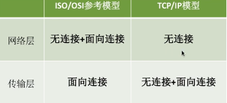
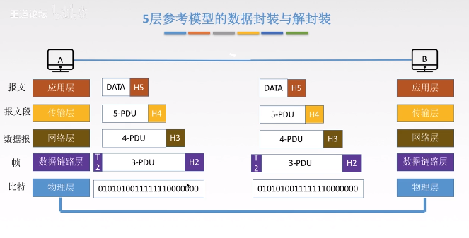

## OSI参考模型（法定标准）

目的：支持异构网络系统的互联互通。

层次：七层（物、链、网、输、会、示、用）

- 应用层，所有能和用户交互产生网络流量的程序（FTP、SMTP、HTTP）
- 表示层，处理两个通信系统交换信息的表示方式（语义语法）【数据格式变化、加密解密、压缩和恢复】
- 会话层，向表示层的实体/用户进程提供建立链接并有序地传输数据（建立同步SYN）
- 传输层，负责主机两个进程的通信，即端到端的通信。传输单位是报文段或者用户数据报。（可靠传输、不可靠传输、差错控制、流量控制、复用分用）（TCP、UDP）
- 网络层，主要任务是把分组从源端传到目的端，为分组交换网上的不同主机提供通信服务网络层传输单位是数据报。（①路由选择、②流量控制、③差错控制、④ 拥塞控制）
- 数据链路层，传输单位是帧（成帧、差错控制、流量控制、访问控制）
- 物理层，物理媒体上实现比特流的透明传输，传输单位是比特。（透明传输：不管传输的数据什么样的比特组合，都应当在链路上传送）（功能：定义接口的特性、定义传输模式、定义传输速率、比特同步、比特编码）

## TCP/IP参考模型（事实标准）

层次：应用层（HTTP、FTP、DNS）、传输层（TCP、UDP）、网际层（IP）、网络接口层

与OSI参考模型的区别

## 五层参考模型（综合了OSI和TCP/IP的优点）

层次：应用层、传输层、网络层、数据链路层、物理层

