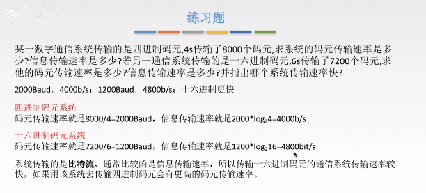

### 码元 

概念：指用一个固定时长的信号波形，代表不同的离散数值的基本波形，是数字通信中数字信号的计量单位，这个时长内的信号称为*k进制码元*，而该时长成为*码元宽度*。当码元的离散状态有M个时（M大于2），此时码元*为M进制码元*。

1码元可以携带多个比特的信息量。例如，在使用二进制编码时，只有两种不同的码元，一种代表0状态，另一种代表1状态。（两种高低不同的波形，4进制码元就有四种不同的波形）

### 速率、波特、带宽

*速率*也叫数据率，是指数据的传输速率表示单位时间内传输的数据量。可以用码元传输速率和信息传输速率表示。

1. 码元传输速率（一秒传输多少个码元），单位是波特（Baud）
2. 信息传输速率（一秒多传输少个比特），单位是比特/秒

<u>一个码元携带n bit的信息量，则M Baud的码元传输速率所对应的信息传输速率为M*n bit/s</u>

带宽：表示在单位时间内从网络中的某一个点到另一点所能通过的“***最高数据率***”，常用来表示网络的通信线路所能传输数据的能力，单位是b/s。

### 习题

